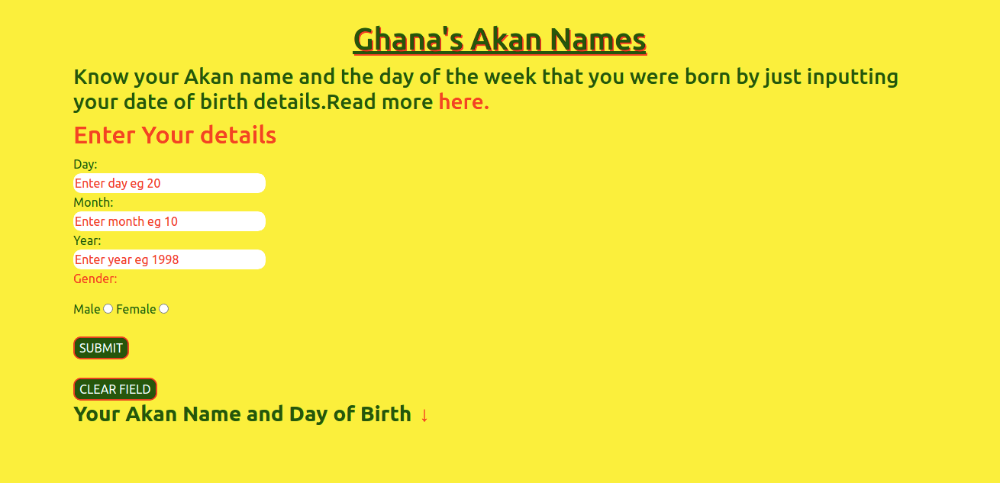

# Akan-Names
#### A simple Akan Names Generator Website Application, 5th September 2021
#### By **Ezekiel Kibiego**

## ScreenShot

## Description
This is a Web Application that allows the user to know his/her exact day of birth and also assigns an Akan name to him/her on filling on his/her year, month, and date of birth.

# Installation / Setup instruction

<ul>
<li>Open Terminal {Ctrl+Alt+T}</li>
<li>git clone https://github.com/ezekielkibiego/Akan-Names.git</li>
<li>cd Akan-Names</li>
<li>code . for VS code to run it</li>
<li>Go live or start your server</li>
</ul>

### Live Link

<a>https://ezekielkibiego.github.io/Akan-Names/</a>

## Known Bugs

No known Bugs yet

## Technologies Used

<ul>
<li>JAVASCRIPT</li>
<li>HTML</li>
<li>CSS</li>
<li>BOOTSTRAP</li>
</ul>

## BDD
Enter century of birth example 19 for 1998, Input Example 19 Output example 19

<ul>
<li>Enter year of Birth example 98 for 1998 Input Example 98 Output Example 98
</li>
<li>Enter month of birth example 10 for October Input example 10 Output example 10</li>
<li>Enter Date of the month you were born in, example 25 input example 25 output example 25</li>
<li>Select/check gender Input example male output male or female input female</li>
<li>Click Submit</li>
</ul>

## Support and contact details
In case of any contributions or questions, email ezekiel.nyambane@student.moringaschool.com or kibiezekiel@gmail.com

### License

 #### MIT LICENCE

Copyright (c) 2021 **Ezekiel Kibiego**
Permission is hereby granted, free of charge, to any person obtaining a copy
of this software and associated documentation files (the "Software"), to deal
in the Software without restriction, including without limitation the rights
to use, copy, modify, merge, publish, distribute, sublicense, and/or sell
copies of the Software, and to permit persons to whom the Software is
furnished to do so, subject to the following conditions:

The above copyright notice and this permission notice shall be included in all
copies or substantial portions of the Software.

THE SOFTWARE IS PROVIDED "AS IS", WITHOUT WARRANTY OF ANY KIND, EXPRESS OR
IMPLIED, INCLUDING BUT NOT LIMITED TO THE WARRANTIES OF MERCHANTABILITY,
FITNESS FOR A PARTICULAR PURPOSE AND NONINFRINGEMENT. IN NO EVENT SHALL THE
AUTHORS OR COPYRIGHT HOLDERS BE LIABLE FOR ANY CLAIM, DAMAGES OR OTHER
LIABILITY, WHETHER IN AN ACTION OF CONTRACT, TORT OR OTHERWISE, ARISING FROM,
OUT OF OR IN CONNECTION WITH THE SOFTWARE OR THE USE OR OTHER DEALINGS IN THE
SOFTWARE.
  

